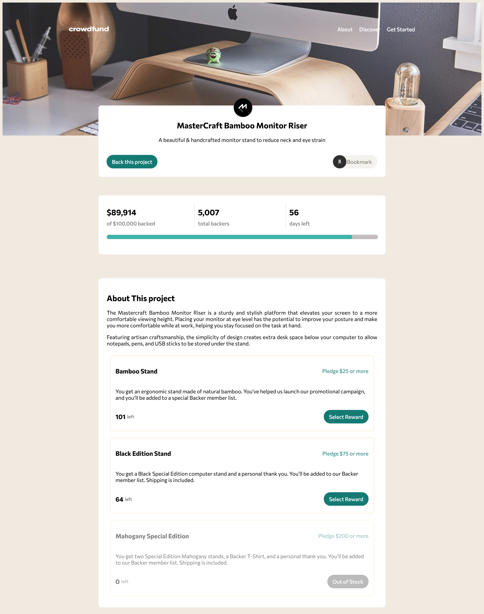

# Frontend Mentor - Crowdfunding product page solution

This is a solution to the [Crowdfunding product page challenge on Frontend Mentor](https://www.frontendmentor.io/challenges/crowdfunding-product-page-7uvcZe7ZR). Frontend Mentor challenges help you improve your coding skills by building realistic projects.

## Table of contents

- [Overview](#overview)
  - [The challenge](#the-challenge)
  - [Screenshot](#screenshot)
  - [Links](#links)
- [My process](#my-process)
  - [Built with](#built-with)
  - [What I learned](#what-i-learned)
  - [Continued development](#continued-development)
  - [Useful resources](#useful-resources)
- [Author](#author)
- [Acknowledgments](#acknowledgments)

## Overview
Crowdfunding product page is a single page web application, where there has a banner section, along with has a title, counter & about section.In this site user can interact, & can give donation.

### The challenge

Users should be able to:

- View the optimal layout depending on their device's screen size
- See hover states for interactive elements
- Make a selection of which pledge to make
- See an updated progress bar and total money raised based on their pledge total after confirming a pledge
- See the number of total backers increment by one after confirming a pledge
- Toggle whether or not the product is bookmarked

### Screenshot
- Here is the site view.


### Links

- Solution URL: [Github-Link](https://github.com/Saimon8420/crowdFunding_FrontEnd)
- Live Site URL: [Crowd-Funding](https://guileless-kashata-7af0c1.netlify.app/)

## My process

### Built with

- React Js
- Semantic HTML5 markup
- Vanilla CSS with custom properties
- FlexBox
- CSS Grid
- Mobile-first workflow

### What I learned

From this project i polished some of my skills, one of them is position, with the help of CSS position property. And also i able to make modals, without any 3rd party libraries and frameworks.

To see how you can add code snippets, see below:

```html
<h1>Some HTML code I'm proud of</h1>
```
```css
.proud-of-this-css {
  color: papayawhip;
}
```
```js
const proudOfThisFunc = () => {
  console.log('🎉')
}
```

### Continued development

I will focusing on svg image/icons in future project. still i'm not comfortable with this, so this part will be my future focusing target.

### Useful resources

- [Example resource 1](https://getcssscan.com/css-box-shadow-examples) - This helped me for creating box shadow.There was lot's of in build box-shadow along with css code. I really liked this pattern and will use it going forward.

## Author

- Website - [Md. Latiful Kabir](https://darling-pithivier-cad7d7.netlify.app/)
- Frontend Mentor - [@Saimon8420](https://www.frontendmentor.io/profile/Saimon8420)

## Acknowledgments

The credit goes to frontend mentor. This platform is like blessing. To develop and polishing skills,and become an expert as a front-end developer,this will help a lot.I'll definitely work with them to build up my skills at a higher level.

